# 💻 Softeer6th - team3 공공즈

## 📌 Ground Rule
1. 아이디어를 제시할 때 어느정도 문제가 존재한다는 실제 사례를 함께 제시할 것
    1. 그것을 바탕으로 상대를 설득하는 방향으로 아이디어 제시 (실제 발표도 설득을 바탕)
2. 누군가가 제시한 아이디어에 대한 문제점을 생각 해줄 것
    1. 이것 또한 실제 사례를 들고와서 제시할 것
    2. 다른 사람의 의견을 보았을 때 문제점이 더 잘 보이는 경향이 있음
    3. 여기서 문제점을 제시하는 것의 목적이 Kill 이 되어서는 안됨 더 좁은 문제로 좁히기 위함임을 명심할 것
3. 누군가가 과도하게 본인의 주장을 제시할 시 팀원이 저지해줄 것
   
## 📦 Data Product  
### 포트홀 위험 알림 내비게이션 서비스 !


## 🔍 문제 상황  
- 포트홀의 주된 이유는 주로 동절기나 장마철에 많이 발생되는데, 눈‧비 등 여러 원인에 의해 아스팔트 균열이 일어남
- 고속도로 포트홀 피해 보상액
- 2020년 4440건 14.33억
- 2021년 4285건 19.51억
- 2022년 4509건 24.94억
- 2023년 5801건 30.39억
- 2024년 4992건 29.06억
- 포트홀 피해 보상액은 평균적으로 50% 정도만 보상해준다.
- 고속도로의 배상금액이 위와같은 규모이고, 일반도로 그리고 운전자의 피해금액을 생각하면 훨씬 피해액이 큼
- 카카오맵에서 최근 7일간 포트홀 사고 지역을 제공하지만, 이를 활용하고 있지 않음

## 💡 해결 방법  
- 포트홀 위험 알림 내비게이션 서비스(기존 네비게이션 서비스에 추가하여 길 안내시 고려할 수 있도록)

필요 지표:
- 포트홀 사고 위치 지표 - 포트홀로 인한 사고가 일어난 위치, 포트홀을 우회하기 위해 사용
- 포트홀 보수 현황 - 사고가 일어난 위치가 보수가 되었지만 포트홀이 일어났다면 주변에도 일어날 확률이 높아 위험요소가 있음

네비게이션 서비스 자체를 제공하고자 한다면
- 이동 거리 지표 - 목적지까지 사고지역을 우회하여 가기위해 필요한 지표
- 거리 혼잡도 지표 - 목적지까지 사고지역을 우회하여 가기위해 필요한 지표

## 🛠 파이프라인

```mermaid
graph LR
A[데이터 수집] --> B[전처리]
B --> C[분석 및 정제]
C --> D[시각화]
D --> E[서비스 배포]
```



## ✨ 주요 기능  
- 
- 
- 


## 🧠 협업 노션  
📎 [Notion 바로가기](https://chayhyeon.notion.site/245331850b7b80b299e9c01ba572cc63)

---

## 👨‍💻 팀원 소개

<br/>

<div align="center">
<table>
<th>팀원</th>
    <th> 정세종 <a href="https://github.com/sejjong"><br/><a></th>
	  <th> 임채현 <a href="http://github.com/bkindtoevery1"><br/></a></th>
    <th> 박병준 <a href="https://github.com/bjpark0925"><br/></a></th>
    <tr>
    <td> 팀원 소개 </td>
    	<td>
        
      </td>
    	<td>
        
     </td>
      <td>
        
      </td>
    </tr>
  </table>
</div>
<br />
<br />


---

## 📂 프로젝트 정보

- ⏱ 기간: 2025.08.04 ~ 2025.08.30  
- 🛠 기술 스택: Python, Docker, AWS, Airflow, DynamoDB
- 🚀 배포 링크:

```bash
📁 저장소 구조
├── preprocessing/
├── extract/
├── data/
└── README.md
```
