# 💻 Softeer6th - team3 공공즈

## 📦 Data Product  


## 🔍 문제 상황  


## 💡 해결 방법  


## 🛠 파이프라인

```mermaid
graph LR
A[공공데이터 수집] --> B[전처리]
B --> C[분석 및 정제]
C --> D[시각화 대시보드]
D --> E[웹 서비스 배포]
```



## ✨ 주요 기능  
- 
- 
- 


## 🧠 협업 노션  
📎 [Notion 바로가기](https://www.notion.so/your-team-notion-link)

---

## 👨‍💻 팀원 소개

| 팀원 |  |  |  |
|------|---|---|---|
| 팀원 소개 |  <br/> 검나 카리스마 있어 |  <br/> 검나 카리스마 있어 |  <br/> 검나 카리스마 있어 |
| 역할 | Web Backend | Web Frontend | Web Fullstack (Lead) |

---

## 📂 프로젝트 정보

- ⏱ 기간: 2025.08.04 ~ 2025.08.30  
- 🛠 기술 스택: Python, Docker, AWS, Airflow, DynamoDB
- 🚀 배포 링크:

```bash
📁 저장소 구조
├── backend/
├── frontend/
├── data/
└── README.md
```
